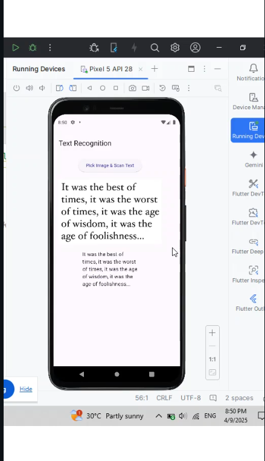

# 🧠 Flutter ML Kit OCR App

This Flutter app uses **Firebase ML Kit** to perform **real-time text recognition (OCR)** from images. Just pick an image from your gallery, and it extracts the text!

---

## ✨ Features
- 🔍 Text recognition from gallery images
- 📱 Clean UI for beginners
- ⚡ Powered by Firebase ML Kit
- 🎯 Lightweight, no heavy dependencies

---

## 🚀 Getting Started

### Prerequisites:
- Flutter installed
- Firebase project with ML Kit enabled

### Steps:
1. Clone this repo
2. Run `flutter pub get`
3. Add your `google-services.json` file
4. Run on emulator or real device (Android)

---

## 📸 Screenshots

---

## 🧰 Built With
- Flutter
- Firebase ML Kit
- image_picker

---

## 📃 License
This project is licensed under the MIT License.
